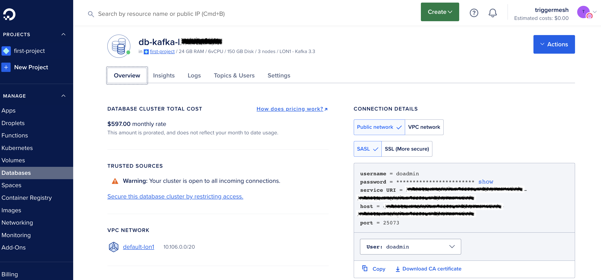
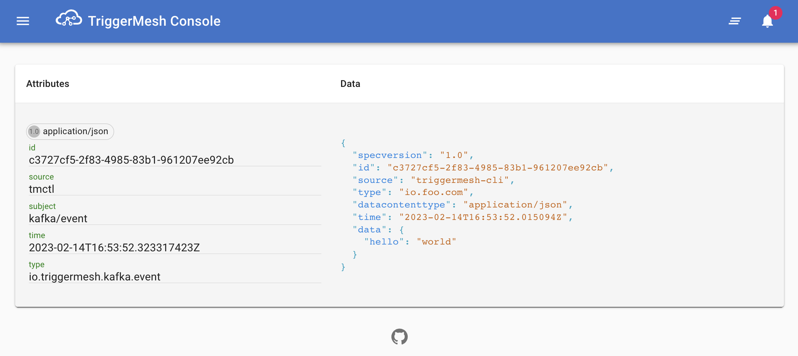

# Using a DigitalOcean Kafka Cluster

With `tmctl` you can create a Kafka Target to produce events into a Kafka topic and with a Kafka Source you can consume events from a Kafka topic. In this guide we are going to show you how to do it with a Kafka cluster on DigitalOcean.

!!! Tip
    Verify that you have configured [auto-completion](../get-started/autocompletion.md) for `tmctl` to help you configure all the source and target parameters easily.

    ```console
    $ tmctl completion
    ```

## Get the Kafka Cluster Connection Details

Head to the DO console of your Kafka cluster and select the Overview tab as shown below.



Note the `username`, `password`, `host` and `port` and download the CA certificate to a local file.

## Create an Event Broker

We start by creating an event broker

```console
$ tmctl create brokers do
```

## Create a Kafka Target

To produce messages to a Kafka topic you need to setup a Kafka target.

```console
tmctl create target kafka \
      --bootstrapServers <host:port>\
      --topic tmctl \
      --auth.username doadmin \
      --auth.password <password> \
      --auth.saslEnable true \
      --auth.tlsEnable true \
      --auth.securityMechanism PLAIN \
      --auth.tls.ca "$(cat /path/to/ca-certificate.crt)"
```

You will then be able to _describe_ your Pipe and see the Docker container corresponding to your Kafka producer running.

```console
tmctl describe
Broker     Status
do         online(http://localhost:54556)

Target             Kind            Expected Events     Status
do-kafkatarget     kafkatarget     *                   online(http://localhost:54811)

docker ps
CONTAINER ID   IMAGE                                            COMMAND                  CREATED          STATUS          PORTS                     NAMES
3dd0f90231c3   gcr.io/triggermesh/kafkatarget-adapter:v1.23.2   "/ko-app/kafkatarget…"   22 seconds ago   Up 21 seconds   0.0.0.0:54811->8080/tcp   do-kafkatarget
bc7986f80c62   gcr.io/triggermesh/memory-broker:latest          "/memory-broker star…"   58 minutes ago   Up 58 minutes   0.0.0.0:54556->8080/tcp   do-broker

```

!!! Tip
    You can also use the SSL connection parameters instead of SASL.

### Send an event to Kafka

To send an sample event to your Kafka topic, you can use the `tmctl send-event` command and specify your Kafka target.

```console
tmctl send-event --eventType io.foo.com '{"hello":"world"}' \
                 --target do-kafkatarget
Destination: do-kafkatarget(http://localhost:54811)
Request:
------
Context Attributes,
  specversion: 1.0
  type: io.foo.com
  source: triggermesh-cli
  id: 
  datacontenttype: application/json
Data (binary),
  {
    "hello": "world"
  }
------
Response: OK
```

In the DO console if you go to the Insight tab of your Kafka cluster, you should be able to see the message count increase.

## Create a Kafka Source

To consume from your Kafka topic (e.g `tmctl`) you need to setup a Kafka source component like so:

```console
tmctl create source kafka \
      --bootstrapServers <host:port> \
      --topic tmctl \
      --groupID foobar \
      --auth.username doadmin \
      --auth.password <password> \
      --auth.saslEnable true \
      --auth.tlsEnable true \
      --auth.securityMechanism PLAIN \
      --auth.tls.ca "$(cat /Users/sebgoa/Desktop/ca-certificate.crt)"
```

When describing your Pipe you will now see a Kafka source component which emits events of type `io.triggermesh.kafka.event`

```console
$ tmctl describe
Broker     Status
do         online(http://localhost:54556)

Source             Kind            EventTypes                     Status
do-kafkasource     kafkasource     io.triggermesh.kafka.event     online(http://localhost:54968)

Target             Kind            Expected Events     Status
do-kafkatarget     kafkatarget     *                   online(http://localhost:54811)
```

## Route Kafka Events to a Microservice

To visualize the Kafka events that you are consuming, you can create a local microservice and route the events to it by creating a `trigger`.

First let's run a local event visualizer

```console
tmctl create target --from-image gcr.io/triggermesh/triggermesh-console:v0.0.1
```

And now create the `trigger` to send events of type `io.triggermesh.kafka.event` to it

```console
tmctl create trigger --eventTypes io.triggermesh.kafka.event \
                     --target do-target-service
```

When you describe the Pipe you will see the URL of the event visualizer in the _Status_ column, open it with your browser

```console
tmctl describe
Broker     Status
do         online(http://localhost:54556)

Trigger                 Target                Filter
do-trigger-8cbcd2be     do-target-service     type is io.triggermesh.kafka.event

Source             Kind            EventTypes                     Status
do-kafkasource     kafkasource     io.triggermesh.kafka.event     online(http://localhost:55160)

Target                Kind                                                        Expected Events     Status
do-kafkatarget        kafkatarget                                                 *                   online(http://localhost:54811)
do-target-service     service (gcr.io/triggermesh/triggermesh-console:v0.0.1)     *                   online(http://localhost:55042)
```

Open the console

```console
open http://localhost:55042
```

When you send an event to your Kafka target with the `send-event` command, you will see it appear in the microservice. You successfully produced to a Kafka topic, consumed from it and displayed the event in a local microservice.




You can verify that all the components are running locally

```console
docker ps
CONTAINER ID   IMAGE                                            COMMAND                  CREATED          STATUS          PORTS                     NAMES
8a8f2b5073af   gcr.io/triggermesh/kafkasource-adapter:v1.23.2   "/ko-app/kafkasource…"   4 minutes ago    Up 4 minutes    0.0.0.0:55160->8080/tcp   do-kafkasource
f669bb3ddcde   gcr.io/triggermesh/triggermesh-console:v0.0.1    "/ko-app/triggermesh…"   18 minutes ago   Up 18 minutes   0.0.0.0:55042->8080/tcp   do-target-service
3dd0f90231c3   gcr.io/triggermesh/kafkatarget-adapter:v1.23.2   "/ko-app/kafkatarget…"   32 minutes ago   Up 32 minutes   0.0.0.0:54811->8080/tcp   do-kafkatarget
bc7986f80c62   gcr.io/triggermesh/memory-broker:latest          "/memory-broker star…"   2 hours ago      Up 2 hours      0.0.0.0:54556->8080/tcp   do-broker
```

You can stop and start the entire Pipe with

```console
tmctl stop
tmctl start
```
