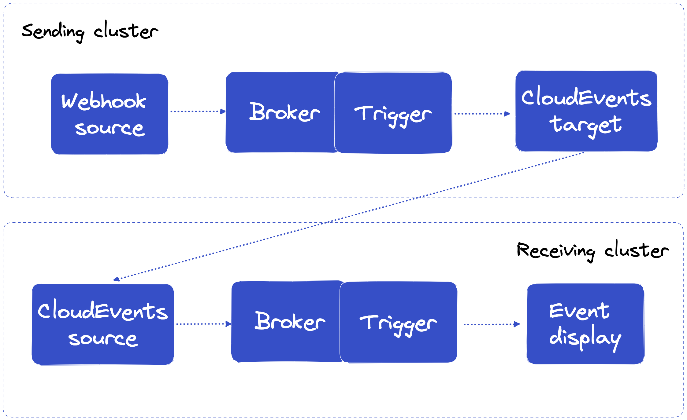

# Connecting TriggerMesh Clusters

!!! Info "Installation"
    Make sure you have completed the installation [procedure](../../installation/index.md) before proceeding with any of the guides.

In this guide we will connect 2 TriggerMesh clusters that will be able to interchange CloudEvents flowing through them. You might want to connect multiple TriggerMesh instances to:

- Move events between environments. For example from production to staging in order to perform tests with actual events.
- Geographically distribute events among clusters.
- Perform Cluster migrations.
- Integrate heterogenous applications through real time events.

## Scenario

For this scenario we will need to setup 2 TriggerMesh clusters that we will call at this document `ClusterSender` and `ClusterReceiver`.

ClusterSender components:

- `Broker` is the temporary storage for CloudEvents.
- `WebhookSource` is a CloudEvents producer that exposes an interface to accept HTTP post requests and, in return, emits cloud events. 
- `CloudEventsTarget` is a CloudEvents consumer that receives events and then sends them to a user-configurable location.
- `Trigger` will subscribe to CloudEvents at the Broker and send them to the CloudEventsTarget.

ClusterReceiver components:

- `Broker` is the temporary storage for CloudEvents.
- `CloudEventsSource` will listen to CloudEvents from remote locations and send them to the Broker.
- `event-display` service will listen to CloudEvents and log them at the output console.
- `Trigger` will subscribe to CloudEvents at the Broker and send them to the EventDisplay.



Events produced at the WebhookSource will flow as depicted above until they reach the EventDisplay at the second cluster.

## Setup

!!! Info "Local setup"
    You can use a local setup by creating 2 kind clusters.

    ```console
    $ kind create cluster --name clustersender
    ...

    $ kind create cluster --name clusterreceiver
    ...
    ```

    Add LoadBalancer support to the receiver cluster by following [kind instructions](https://kind.sigs.k8s.io/docs/user/loadbalancer/).

    You can switch to each configured cluster using `kubectl config use-context` command.

    ```console
    $ kubectl config use-context kind-clustersender

    $ kubectl config use-context kind-clusterreceiver
    ```

### Receiver Cluster

!!! Info "Receiver cluster"
    Make sure your kubectl configuration is pointing to the receiver cluster.

Create the Broker as the host for this cluster's CloudEvents:

```yaml
apiVersion: eventing.triggermesh.io/v1alpha1
kind: MemoryBroker
metadata:
  name: receiver
```

Create a service that runs the `event_display` image. We will look for received events by looking at the logs of this service.

```yaml
apiVersion: apps/v1
kind: Deployment
metadata:
  name: event-display
spec:
  replicas: 1
  selector:
    matchLabels: &labels
      app: event-display
  template:
    metadata:
      labels: *labels
    spec:
      containers:
        - name: event-display
          image: gcr.io/knative-releases/knative.dev/eventing/cmd/event_display

---

kind: Service
apiVersion: v1
metadata:
  name: event-display
spec:
  selector:
    app: event-display
  ports:
  - protocol: TCP
    port: 80
    targetPort: 8080
```

Using a Trigger we can link the `event-display` service with the broker to subscribe to all events flowing through it.

```yaml
kind: Trigger
apiVersion: eventing.triggermesh.io/v1alpha1
metadata:
  name: all-events-to-event-display
spec:
  broker:
    group: eventing.triggermesh.io
    kind: MemoryBroker
    name: receiver
  subscriber:
    ref:
      apiVersion: v1
      kind: Service
      name: event-display
```

The `CloudEventsSource` component will expose an HTTP endpoint that ingest CloudEvents from external systems. We will configure this component to send ingested CloudEvents to the broker.

```yaml
apiVersion: sources.triggermesh.io/v1alpha1
kind: CloudEventsSource
metadata:
  name: gateway-in
spec:
  sink:
    ref:
      apiVersion: eventing.triggermesh.io/v1alpha1
      kind: MemoryBroker
      name: receiver
```

After completing the setup for all the receiver cluster components, any CloudEvent sent to the `CloudEventsSource` public endpoint will flow throw the broker and be delivered to the `event-display` service.

We will retrieve and take note of the exposed URL at the `CloudEventsSource`, it will be used later at the the sender cluster.

```console
kubectl get cloudeventssources.sources.triggermesh.io gateway-in -ojsonpath='{.status.address.url}'
```

### Sender Cluster

!!! Info "Sender cluster"
    Make sure your kubectl configuration is pointing to the sender cluster.

Create the Broker that as the host for this cluster's CloudEvents:

```yaml
apiVersion: eventing.triggermesh.io/v1alpha1
kind: MemoryBroker
metadata:
  name: sender
```

A `WebhookSource` exposes and HTTP endpoint that receives HTTP POST requests and produces a CloudEvent to the broker.

```yaml
apiVersion: sources.triggermesh.io/v1alpha1
kind: WebhookSource
metadata:
  name: webhook
spec:
  eventType: webhook.event
  sink:
    ref:
      apiVersion: eventing.triggermesh.io/v1alpha1
      kind: MemoryBroker
      name: sender
```

The `CloudEventsTarget` component is able to subscribe to a broker (using a trigger), and forward events to a remote destination. We will configure this component using the endpoint exposed by the `CloudEventsSource` at the destination cluster, make sure you replace the placeholder text at the following command.

```yaml
apiVersion: targets.triggermesh.io/v1alpha1
kind: CloudEventsTarget
metadata:
  name: gateway-out
spec:
  endpoint: <REPLACE-WITH-CLOUDEVENTSSOURCE-HTTP-ENDPOINT>
```

Subscribing the `CloudEventsTarget` to CloudEvents flowing through a broker is done via a trigger.

```yaml
kind: Trigger
apiVersion: eventing.triggermesh.io/v1alpha1
metadata:
  name: all-events-to-cloudeventstarget
spec:
  broker:
    group: eventing.triggermesh.io
    kind: MemoryBroker
    name: sender
  subscriber:
    ref:
      apiVersion: targets.triggermesh.io/v1alpha1
      kind: CloudEventsTarget
      name: gateway-out
```

### Receiving Events

With all components being setup we can now send an event into the `WebhookSource` at the sender cluster, and it should show up in the `event-display` service at the receiver cluster. We can make sure by looking at the receiving service logs.

First, lets retrieve the URL on which the Webhook is listening for incoming requests.

```console
$kubectl get webhooksources.sources.triggermesh.io webhook
NAME      READY   REASON   URL                                                              SINK                                                     AGE
webhook   True             http://webhooksource-webhook.default.127.0.0.1.sslip.io   http://demo-mb-broker.default.svc.cluster.local   4m14s
```

Use `curl` or any HTTP capable client to post an event to the webhook.

```console
curl -d '{"message": "greetings from sender cluster"}' http://webhooksource-webhook.default.127.0.0.1.sslip.io
```

```console
$ kubectl logs deployments/event-display
Context Attributes,
  specversion: 1.0
  type: webhook.event
  source: /apis/v1/namespaces/default/pingsources/periodic-event-producer
  id: eddd0d10-64ef-4c82-bfc0-c0caea63a510
  time: 2022-05-26T12:44:00.265933805Z
  datacontenttype: application/json
Data,
  {
    "message": "greetings from sender cluster"
  }
```

## Further improvements

Triggers can be configured with filters to make sure only allowed CloudEvents travels between clusters. Refer to [trigger's documentation](../../brokers/triggers.md) for configuration options.

[CloudEventsSource](../../sources/cloudevents.md) and [CloudEventsTarget](../../targets/cloudevents.md) can be configured with HTTP Basic Authentication.

!!! Info "HTTP Basic Authentication"
    HTTP Basic Authentication is not encrypted. When used it is thoroughly recommended that services are configured with TLS capabilities.
